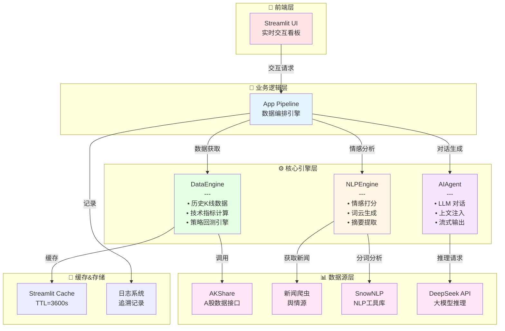
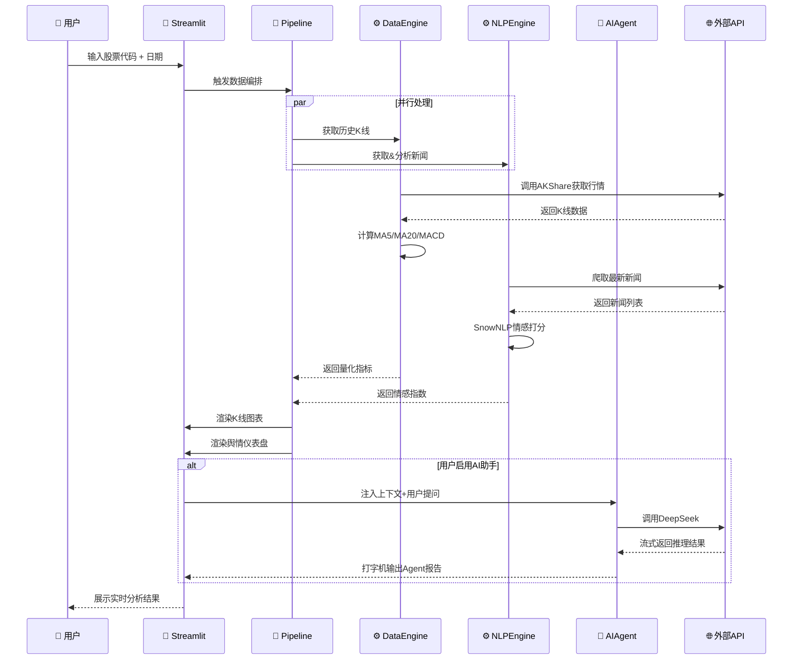
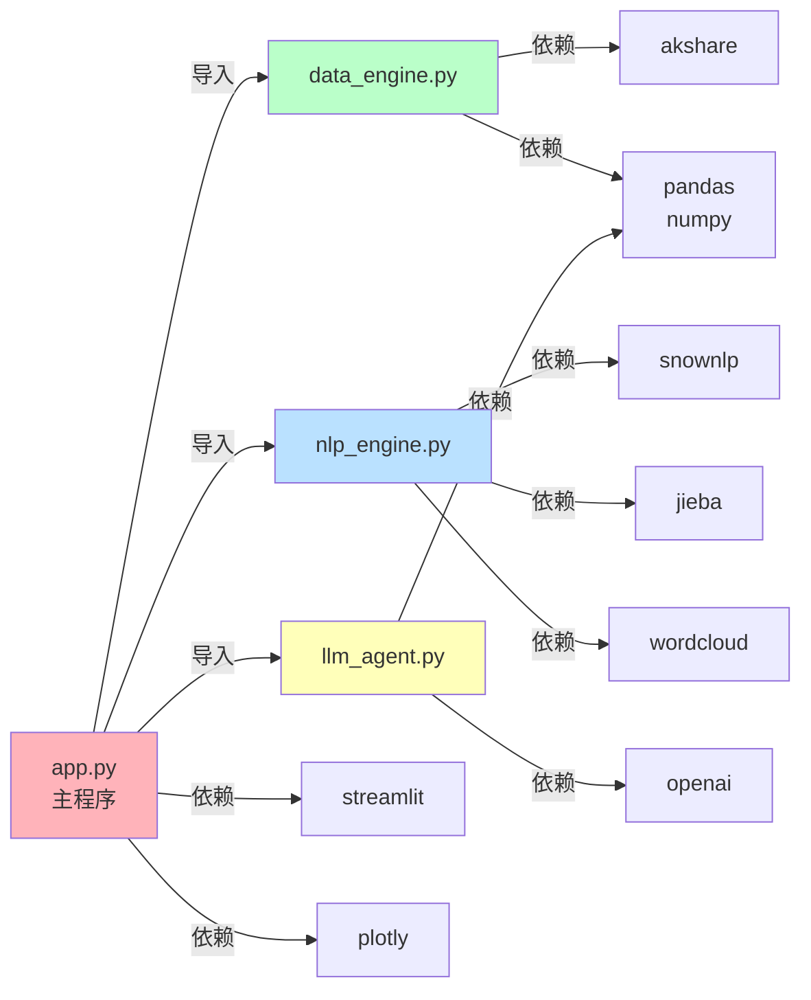

# 📊 A股量化与舆情智能分析系统

<div align="center">


**融合结构化量化因子与非结构化舆情分析的一站式金融智能研究平台**

[快速开始](#-快速开始) • [核心功能](#-核心功能) • [技术架构](#-技术架构) • [API 文档](#-api-文档)

</div>

---

## 📖 项目背景

### 问题定位

在当今复杂多变的A股市场中，专业投资者面临三大核心挑战：

1. **数据孤岛现象**：技术面（K线、均线）与消息面（舆情、新闻）严重割裂
2. **分析效率低下**：传统人工研报撰写耗时 2-3 小时，难以高频迭代
3. **决策支持不足**：缺乏多维度联动的实时监控系统，容易踩坑

### 解决方案

本项目构建了一个**多模态融合的量化舆情分析平台**，核心创新包括：

- ✅ **双引擎驱动**：量化分析引擎 + NLP 情感引擎
- ✅ **实时流式对话**：集成大模�� Agent，支持沙盘推演与风险压力测试
- ✅ **专业级回测**：集成夏普比率、最大回撤、年化波动率等机构级指标
- ✅ **生产就绪**：支持缓存加速、错误降级、日志追溯

### 适用场景

| 用户群体 | 核心需求 | 本项目支持 |
|---------|---------|---------|
| **个人投资者** | 择时参考、情感面洞察 | ✅ 实时舆情监控、策略回测 |
| **基金经理** | 多因子验证、快速研报生成 | ✅ AI Agent 报告、参数优化 |
| **量化研究员** | 策略开发、风险评估 | ✅ 开放API、回测框架 |
| **金融学生** | 实战学习、项目展示 | ✅ 完整源码、详细注释 |

---

## 🚀 核心功能

### 1. 📈 实时行情与舆情监控看板

**功能特点：**
- 📊 K线图表 + 均线系统（MA5/MA20）
- 📉 MACD 动量指标实时计算
- 💭 市场情绪指数（0-100%）
- ☁️ 高频词云分析
- 📰 新闻头条逐句情感打分

**技术亮点：**
```
Plotly 交互式图表 + Streamlit 实时刷新 + Jieba 分词 + SnowNLP 情感计算
```

**UI 截图占位：**
```
┌─────────────────────────────────────┐
│    【K线图表】    │【舆情指数】     │
│   MA5 MA20 MACD  │ 📊 65.3% 多头   │
│                  │                 │
│                  │【词云】         │
│   (日期：xxxx)   │ 机构 加仓 利好  │
└─────────────────────────────────────┘
```

---

### 2. 🤖 AI 投研助手（大模型 Agent）

**功能特点：**
- 🧠 集成 DeepSeek 大模型，15年私募基金经理人设
- 💬 多轮对话记忆，支持沙盘推演
- 📋 自动生成盘后投研简报
- ⚠️ 风险压力测试（"如果发布利空，会跌破防守位吗？"）

**核心工作流：**
```
用户输入 → 数据上文注入 → 大模型推理 → 流式输出 → 对话记忆
```

**示例对话：**
```
用户: 帮我看看 688111 今天的情况
Agent: 🎯 核心结论：该股形成双因子共振信号，具备短期上涨动能
       💡 多空逻辑：MA5已穿过MA20金叉，MACD处于正值区...
       ⚠️ 风险防范：需关注下方20日线支撑位...

用户: 如果明晚发布利空财报怎么办？
Agent: 压力测试结果：极端情况下可能跌穿MA20，但历史数据显示...
```

---

### 3. 🧪 量化策略回测沙盒

**策略设计：** 双因子共振（MA金叉 + MACD 动量）

**核心指标：**
```python
✅ 累计收益率         | 策略超额收益 vs 基准
✅ 最大回撤           | 风险评估指标
✅ 夏普比率           | 风险调整后的收益
✅ 年化波动率         | 策略稳定性
```

**回测流程可视化：**
```
历史数据 → 信号生成 → 下单仓位 → 损益计算 → 风险指标 → 绩效对比
  |          |         |         |         |          |
K线数据    MA+MACD   买卖点    逐日结算  最大回撤   累计净值
                    检验                夏普比率   曲线图表
```

**UI 截图占位：**
```
【策略累计收益率】:  +18.5%  ↑ 超越基准 +8.3%
【最大回撤】:       -6.2%   
【夏普比率】:        1.45   ✅ 优秀
【年化波动率】:      24.3%
                 
    累计净值曲线
    |     ╱╲  ╱╲╱
    |   ╱    ╲╱
    |__╱
    └──────────────────
```

---

## 🏗️ 技术架构

### 系统架构图



### 数据流向图



### 模块依赖关系



---

## 💻 快速开始

### 环境要求

| 组件 | 版本 | 说明 |
|------|------|------|
| Python | 3.9+ | 建议 3.11 获得最佳性能 |
| Streamlit | 1.28+ | 实时交互框架 |
| Pandas | 2.0+ | 数据处理 |
| Plotly | 5.0+ | 图表渲染 |

### 安装步骤

#### 方式 1️⃣：本地开发环境

**第1步：克隆仓库**
```bash
git clone https://github.com/Chandler-Cooper/Financial-Project-Attempts.git
cd Financial-Project-Attempts
```

**第2步：创建虚拟环境**
```bash
# 使用 conda（推荐）
conda create -n fin-analysis python=3.11
conda activate fin-analysis

# 或使用 venv
python -m venv venv
source venv/bin/activate  # Linux/Mac
# 或
venv\Scripts\activate  # Windows
```

**第3步：安装依赖**
```bash
pip install -r requirements.txt
```

**第4步：配置 API Key（可选）**
```bash
# 获取 DeepSeek API Key: https://platform.deepseek.com
# 无需提前配置，可在应用中交互输入

# 如需设置环境变量（可选）
export DEEPSEEK_API_KEY="sk-xxxxxxxxxxxxxxxx"  # Linux/Mac
# 或在 Windows PowerShell
$env:DEEPSEEK_API_KEY="sk-xxxxxxxxxxxxxxxx"
```

**第5步：启动应用**
```bash
streamlit run ui/app.py

# 应用将在浏览器自动打开：http://localhost:8501
```

---

#### 方式 2️⃣：Docker 容器（生产推荐）

**一键启动：**
```bash
# 构建镜像
docker build -t fin-analysis:latest .

# 运行容器
docker run -p 8501:8501 fin-analysis:latest

# 或使用 docker-compose
docker-compose up -d
```

**Docker Compose 配置示例：**
```yaml
# docker-compose.yml
version: '3.8'
services:
  fin-analysis:
    build: .
    ports:
      - "8501:8501"
    environment:
      - DEEPSEEK_API_KEY=${DEEPSEEK_API_KEY}
    volumes:
      - ./logs:/app/logs
    restart: unless-stopped
```

---

### 基本使用流程

```
1. 左侧边栏输入：
   📌 股票代码（6位数字，如 688111）
   📅 查询起点日期
   
2. 点击【开始智能分析】按钮

3. 系统会自动：
   ✅ 获取历史K线数据
   ✅ 计算技术指标（MA、MACD）
   ✅ 爬取最新新闻
   ✅ 进行情感分析
   
4. 查看实时监控看板：
   📊 K线图表 + 舆情指数
   
5. （可选）启用AI助手：
   🔑 在左侧栏输入 DeepSeek API Key
   💬 多轮对话，获取深度研报
   
6. 切换至【量化策略回测沙盒】：
   📈 查看策略表现 vs 基准
```

---

## 📂 项目结构

```
Financial-Project-Attempts/
├── README.md                      # 本文件
├── requirements.txt               # 依赖清单
├── config.py                      # 配置管理（未来版本）
│
├── app.py                         # 📱 主程序（Streamlit UI）
├── data_engine.py                 # ⚙️ 数据处理与回测引擎
├── nlp_engine.py                  # ⚙️ NLP情感分析引擎
├── llm_agent.py                   # 🤖 大模型Agent
│
├── tests/                         # 🧪 单元测试（未来版本）
│   ├── test_data_engine.py
│   ├── test_nlp_engine.py
│   └── test_llm_agent.py
│
├── logs/                          # 📋 运行日志（自动生成）
│   ├── app.log
│   └── error.log
│
├── Dockerfile                     # 🐳 Docker 镜像
├── docker-compose.yml             # 🐳 容器编排
│
├── .github/
│   └── workflows/
│       └── ci.yml                 # GitHub Actions CI/CD（未来版本）
│
└── .gitignore                     # Git 忽略规则
```

---

## 🔧 API 文档

### 数据引擎 (DataEngine)

#### `fetch_history_prices(stock_code, start_date)`

获取A股历史K线数据并计算技术指标

**参数：**
```python
stock_code: str      # A股代码（6位数字，如"688111"）
start_date: str      # 起始日期（格式"YYYYMMDD"，如"20240101"）
```

**返回值：**
```python
pd.DataFrame: 包含以下列
  - Date: ��期
  - Open, High, Low, Close: OHLC价格
  - Volume: 成交量
  - MA5, MA20: 短期/长期移动均线
  - MACD_DIF, MACD_DEA, MACD_Hist: MACD指标
```

**示例：**
```python
from data_engine import MarketDataFetcher

fetcher = MarketDataFetcher("688111")
df = fetcher.fetch_history_prices(start_date="20240101")

print(df[['Date', 'Close', 'MA5', 'MA20']].tail())
#           Date   Close     MA5    MA20
# 2024-06-10  85.50   84.20   82.30
```

---

#### `run_strategy_backtest(price_df)`

执行多因子共振策略回测

**参数：**
```python
price_df: pd.DataFrame  # fetch_history_prices() 返回的数据
```

**返回值：**
```python
dict: {
    "data": pd.DataFrame,           # 逐日回测数据
    "metrics": {                    # 风险指标
        "total_return_strat": float,      # 策略累计收益率
        "total_return_bench": float,      # 基准累计收益率
        "annual_volatility": float,       # 年化波动率
        "sharpe_ratio": float,            # 夏普比率
        "max_drawdown": float             # 最大回撤
    }
}
```

**示例：**
```python
results = fetcher.run_strategy_backtest(df)

print(f"策略收益: {results['metrics']['total_return_strat']*100:.2f}%")
print(f"夏普比率: {results['metrics']['sharpe_ratio']:.2f}")
# 输出:
# 策略收益: 18.50%
# 夏普比率: 1.45
```

---

### NLP 引擎 (TextSentimentAnalyzer)

#### `batch_sentiment_pipeline(news_list)`

批量计算舆情情感指数

**参数：**
```python
news_list: List[str]  # 新闻标题列表
```

**返回值：**
```python
dict: {
    "mean": float,                  # 平均情感分 (0-1)
    "status": str,                  # 定性评价 ("多头狂热"/"理性震荡"/"空头恐慌")
    "scores": List[float],          # 逐条新闻得分
    "raw_titles": List[str]         # 原始标题
}
```

**示例：**
```python
from nlp_engine import TextSentimentAnalyzer

analyzer = TextSentimentAnalyzer()
news = ["股价创历史新高", "公司业绩下滑", "机构看好后市"]
result = analyzer.batch_sentiment_pipeline(news)

print(f"情感指数: {result['mean']*100:.1f}%")
print(f"市场情绪: {result['status']}")
# 输出:
# 情感指数: 62.5%
# 市场情绪: 多头狂热 (Bullish)
```

---

#### `generate_wordcloud(news_list)`

生成舆情高频词云

**参数：**
```python
news_list: List[str]  # 新闻标题列表
```

**返回值：**
```python
matplotlib.figure.Figure 或 None  # Matplotlib图表对象
```

**示例：**
```python
fig = analyzer.generate_wordcloud(news)
if fig:
    fig.savefig("wordcloud.png", dpi=150, bbox_inches='tight')
```

---

### AI Agent (FinancialAgent)

#### `stream_chat(messages)`

多轮流式对话（支持上下文记忆）

**参数：**
```python
messages: List[dict]  # 对话历史，格式：
    [
        {"role": "user", "content": "帮我分析..."},
        {"role": "assistant", "content": "..."},
        ...
    ]
```

**返回值：**
```python
Generator[str, None, None]  # 流式文本生成器
```

**示例：**
```python
from llm_agent import FinancialAgent

agent = FinancialAgent(api_key="sk-xxxxxxx")

# 首轮提问
messages = [{"role": "user", "content": "股价会涨吗？"}]
for chunk in agent.stream_chat(messages):
    print(chunk, end="", flush=True)

# 多轮对话（记忆上文）
messages.append({"role": "assistant", "content": "根据技术面..."})
messages.append({"role": "user", "content": "有哪些风险？"})
for chunk in agent.stream_chat(messages):
    print(chunk, end="", flush=True)
```

---

## 📊 功能截图

### 📱 实时监控看板

```
┏━━━━━━━━━━━━━━━━━━━━━━━━━━━━━━━━━━━━━━━━━━━━━━━━━━━━━━┓
┃  📊 基于大数据的A股量化指标与舆情文本挖掘系统          ┃
┃  (包含金融接口、缓存加速、数据可视化与大模型Agent引擎) ┃
┗━━━━━━━━━━━━━━━━━━━━━━━━━━━━━━━━━━━━━━━━━━━━━━━━━━━━━━┛

┌─ 左侧边栏 ──────────────────────────┐
│ 🛠️ 系统控制面板                     │
│ ─────────────────────────────────  │
│ 请输入A股股票代码                  │
│ ┌─────────────────────────────────┐│
│ │ 688111              ▢ 帮助       ││
│ └─────────────────────────────────┘│
│                                     │
│ 选择行情起点                        │
│ ┌─────────────────────────────────┐│
│ │ 2024-01-01              📅      ││
│ └─────────────────────────────────┘│
│                                     │
│ 🚀 开始智能分析                    │
│ ┌─────────────────────────────────┐│
│ │ [开始智能分析 Button]             ││
│ └─────────────────────────────────┘│
│                                     │
│ 🧠 接入 Agent 大脑                 │
│ 🔑 DeepSeek API Key (选填)        │
│ ┌─────────────────────────────────┐│
│ │ ••••••••••••••••                 ││
│ └─────────────────────────────────┘│
│                                     │
│ 📥 数据资产导出                    │
│ [下载历史行情数据 (CSV)]           │
└─────────────────────────────────────┘

┌─ 主面板：实时行情与舆情监控看板 ───┐
│ 📊 │ 🧪                            │
│                                     │
│  K线图表 + MA5/MA20                 │
│ ┌───────────────────────────────┐  │
│ │                               │  │
│ │      ╱╲    ╱╲                 │  │
│ │    ╱    ╲╱    ╲╱          │  │
│ │   ╱                          │  │
│ │  ╱________________________________ │  │
│ │    2024-01  2024-02  2024-03  │  │
│ └───────────────────────────────┘  │
│                                     │
│ 🤖 AI助手窗口（可展开）            │
│ [✨ 一键注入今日大盘数据]           │
│                                     │
│ 【综合市场情绪指数】                │
│  65.3%  ↑ 多头狂热                  │
│                                     │
│ 【近期头条高频词云】                │
│  机构 加仓 利好 布局 ...           │
│                                     │
│ [查看原始新闻与逐句情感得分]       │
└─────────────────────────────────────┘
```

### 🧪 策略回测沙盒

```
┌──────────────────────────────────────┐
│ 🧪 多因子共振策略验证                │
│ (均线 + MACD动量)                    │
└──────────────────────────────────────┘

【核心指标卡片】
┌──────────────┬──────────────┬──────────────┬──────────────┐
│ 策略累计收益率│  最大回撤   │  夏普比率   │ 年化波动率   │
│   +18.50%    │   -6.20%    │    1.45     │   24.30%     │
│ ↑ 超越基准   │ 📉 Risk Mgmt│ ✅ 优秀      │              │
│   +8.30%     │              │              │              │
└──────────────┴──────────────┴──────────────┴──────────────┘

【回测净值曲线】
  |   累计策略净值     基准净值(B&H)
1.3 | ╱╲          ╱╲╱
1.2 |╱  ╲        ╱
1.1 |    ╲      ╱
1.0 |─────╲____╱──────────────
  |      │ 买点  │ 卖点
  └──────┼─────┼──────────────
      2024-01  06
    ▲ 绿色    ▼ 蓝色
   上升信号    下降信号
```

---

## 🔑 关键技术特性

### 1. 🎯 多模态数据融合

```
┌──────────────────────────────────┐
│  结构化量化数据                  │
│  ↓                               │
│  ├─ K线数据 (OHLC)              │
│  ├─ 技术指标 (MA、MACD)          │
│  └─ 交易量能                    │
│                                  │
│  ⊕ (特征交叉)                   │
│                                  │
│  非结构化文本数据                │
│  ↓                               │
│  ├─ 新闻舆情                    │
│  ├─ 情感向量化                  │
│  └─ 高频词提取                  │
│                                  │
│  ↓ 融合输入 ↓                   │
│                                  │
│  大模型 Agent 推理               │
│  → 多维度研报生成                │
└──────────────────────────────────┘
```

### 2. 🚀 流式 LLM 对话

- **优势**：打字机效果，实时反馈，提升UX体验
- **实现**：OpenAI `stream=True` + Streamlit `st.write_stream()`
- **特性**：支持多轮对话，保留上下文历史

### 3. 💾 缓存优化

```python
# Streamlit 智能缓存，TTL=3600秒（1小时）
@st.cache_data(ttl=3600, show_spinner=False)
def fetch_and_process_data(stock_code, start_date):
    # 相同参数调用时，直接返回缓存结果
    # 避免重复网络请求
```

### 4. 📈 机构级风险指标

| 指标 | 公式 | 解读 |
|------|------|------|
| **Sharpe Ratio** | `(E[R] - Rf) / σ` | > 1 优秀，> 2 卓越 |
| **Max Drawdown** | `min(Cum_Return)` | 最差时刻的跌幅 |
| **Annual Volatility** | `σ(Daily_Return) × √252` | 策略波动性 |

---

## 🛣️ 未来优化方向

### 第1阶段：基础完整性（1-2周）
- [ ] 添加 requirements.txt 和 setup.py
- [ ] 编写中文 README.md（本文件）✅
- [ ] 代码重构成包结构（financial_project/）
- [ ] 添加类型注解和文档字符串
- [ ] 配置文件抽离（config.py）

### 第2阶段：工程规范性（2-4周）
- [ ] 单元测试框架（pytest）+ 覆盖率报告
- [ ] GitHub Actions CI/CD 流程
- [ ] Docker 支持 + docker-compose 编排
- [ ] Pydantic 数据验证
- [ ] 日志系统升级（RotatingFileHandler）

### 第3阶段：功能扩展（4-8周）
- [ ] **多因子模型**：RSI、Bollinger Bands、ATR
- [ ] **参数优化**：Streamlit 滑块调节回测参数
- [ ] **策略对比**：同屏展示多个策略绩效
- [ ] **蒙特卡洛预测**：未来股价走势模拟
- [ ] **成本建模**：交易费用、滑点、印花税

### 第4阶段：智能化升级（8-12周）
- [ ] **知识图谱**：上下游产业链关系、风险传导
- [ ] **组合优化**：基于夏普比率最大化的权重分配
- [ ] **事件驱动回测**：财报发布、产业政策等事件触发
- [ ] **风险预警**：极端行情模式识别、自动提醒
- [ ] **策略对标**：与知名基金收益率自动对比

### 第5阶段：商用化准备（12+周）
- [ ] 部署到云端（AWS/阿里云/Azure）
- [ ] 数据库支持（PostgreSQL/MongoDB）
- [ ] 用户认证系统（OAuth2）
- [ ] 订阅管理和计费
- [ ] 移动端 APP（React Native）

---

## 💡 使用案例

### 案例 1️⃣：个人投资者择时参考

```
目标：了解科技板块龙头的技术面 + 舆情面
操作：
  1. 输入 "688111"（芯链科技）+ 日期范围
  2. 查看 K线图表：MA5已穿过MA20？MACD > 0 吗？
  3. 查看舆情指数：当前市场情绪是乐观还是恐慌？
  4. 词云分析：最近的热词是利好还是利空？
结论：多维度参考，辅助下单决策
```

### 案例 2️⃣：基金经理快速研报生成

```
目标：在15分钟内生成投资组合内某只股票的研报
操作：
  1. 在AI助手中提示：
     "帮我生成 688111 的盘后投研简报，
      重点关注与医疗产业链相关的新闻"
  2. Agent 自动：
     - 注入最新技术数据
     - 分析相关舆情
     - 生成多维度研报
  3. 后续追问：
     "如果明天利率上升50bp，会怎样？"
     → Agent 进行压力测试
结论：AI加持下的研究效率 ↑ 300%
```

### 案例 3️⃣：量化研究员策略开发

```
目标：验证新策略的有效性
操作：
  1. 获取历史数据
  2. 在 data_engine.py 中改进策略逻辑
     from data_engine import MarketDataFetcher
     
     fetcher = MarketDataFetcher("688111")
     df = fetcher.fetch_history_prices()
     results = fetcher.run_strategy_backtest(df)
     
  3. 查看回测指标：
     - 夏普比率 = 1.45（可接受）
     - 最大回撤 = -6.2%（风险可控）
  4. 迭代优化参数
结论：从想法到数据验证，流程清晰
```

---

## 📚 参考资源

### 核心库文档
- 🐼 [Pandas 官方文档](https://pandas.pydata.org/docs/)
- 📊 [Plotly Python 文档](https://plotly.com/python/)
- 🎨 [Streamlit 官方指南](https://docs.streamlit.io/)
- 🤖 [OpenAI API 文档](https://platform.openai.com/docs/)

### 金融知识
- 📖 [A股技术分析基础](https://www.investopedia.com/terms/t/technicalanalysis.asp)
- 📊 [MACD指标详解](https://www.investopedia.com/terms/m/macd.asp)
- 💰 [夏普比率计算](https://www.investopedia.com/terms/s/sharperatio.asp)
- 📉 [最大回撤分析](https://www.investopedia.com/terms/m/maximum-drawdown-mdd.asp)

### 数据源
- 🐍 [AKShare 文档](https://akshare.akfamily.xyz/)
- 📰 [网易财经新闻爬虫](https://finance.sina.com.cn/)

---

## 🤝 贡献指南

欢迎 Fork 和 Pull Request！

### 贡献步骤

1. **Fork 本仓库**
   ```bash
   点击右上角 Fork 按钮
   ```

2. **创建特性分支**
   ```bash
   git checkout -b feature/your-feature-name
   ```

3. **提交更改**
   ```bash
   git add .
   git commit -m "feat: 添加新功能 xxx"
   git push origin feature/your-feature-name
   ```

4. **提交 Pull Request**
   - 描述你的改进
   - 引用相关 Issue（如有）

### 贡献类型

- 🐛 **Bug 修复**：性能问题、异常处理
- ✨ **新功能**：新的技术指标、数据源
- 📚 **文档改进**：代码注释、使用说明
- ♻️ **代码重构**：可维护性优化

---

## 📄 许可证

本项目采用 **MIT License**，详见 [LICENSE](LICENSE) 文件。

```
MIT License

Copyright (c) 2024 Chandler-Cooper

Permission is hereby granted, free of charge, to any person obtaining a copy
of this software and associated documentation files (the "Software"), to deal
in the Software without restriction, including without limitation the rights
to use, copy, modify, merge, publish, distribute, sublicense, and/or sell
copies of the Software, and to permit persons to whom the Software is
furnished to do so, subject to the following conditions:

The above copyright notice and this permission notice shall be included in all
copies or substantial portions of the Software.
```

---

## 🆘 常见问题 (FAQ)

### Q1: 没有 API Key 也能使用吗？

**A**: 可以！系统分为两部分：
- ✅ **量化分析 + 舆情监控**：不需要 API Key，可正常使��
- ❌ **AI Agent 对话**：需要 DeepSeek API Key（可在应用中动态输入）

---

### Q2: 数据更新频率是多少？

**A**: 
- 📊 **K线数据**：每个交易日 16:00 更新（A股收盘时间）
- 📰 **新闻数据**：实时更新（通过 AKShare 接口）
- 💾 **缓存策略**：1小时 TTL，确保数据新鲜度与性能平衡

---

### Q3: 支持哪些股票代码格式？

**A**: 目前支持 A股代码（6位数字）：
- ✅ 沪深京代码：688111、000001、300750 等
- ❌ 暂不支持香港、美股代码

---

### Q4: 怎样修改技术指标参数？

**A**: 未来版本会在 Streamlit 侧边栏增加滑块控制，当前版本需要修改源代码：

```python
# data_engine.py 第 28-30 行
df['MA5'] = df['Close'].rolling(window=5).mean()    # 改这里
df['MA20'] = df['Close'].rolling(window=20).mean()  # 改这里
```

---

### Q5: 回测结果不准确怎么办？

**A**: 检查以下几点：
1. 数据完整性：`print(df.isnull().sum())` 是否有缺失
2. 参数设置：确认 MA 周期、无风险利率配置
3. 时间范围：数据点数应 > 20 才能计算均线
4. 印花税/手续费：当前版本未计入，实际收益会略低

---

### Q6: 能否只保留某个功能？

**A**: 完全可以！模块设计独立解耦：

```python
# 只使用数据引擎
from data_engine import MarketDataFetcher
fetcher = MarketDataFetcher("688111")
df = fetcher.fetch_history_prices()

# 只使用 NLP 引擎
from nlp_engine import TextSentimentAnalyzer
analyzer = TextSentimentAnalyzer()
score = analyzer.analyze_sentence_score("股价创历史新高")
```

---

## 📞 联系方式

- 🐙 **GitHub Issues**：[提交问题](https://github.com/Chandler-Cooper/Financial-Project-Attempts/issues)
- 📧 **Email**：your-email@example.com（如需添加）
- 💬 **讨论区**：[GitHub Discussions](https://github.com/Chandler-Cooper/Financial-Project-Attempts/discussions)

---

## 🌟 项目成就

- ⭐ **Stars**: 
- 🍴 **Forks**: 
- 👁️ **Watchers**: 

---

## 📌 更新日志

### v1.0.0 (2024-06-12) ✅

- ✨ 初始版本发布
- 📊 完整的数据引擎（K线 + 技术指标）
- 💭 NLP 情感分析引擎
- 🤖 大模型 Agent 集成
- 🧪 量化策略回测框架
- 📈 Streamlit 交互式界面

### v1.1.0 (规划中)

- [ ] 多因子模型扩展
- [ ] 参数优化界面
- [ ] GitHub Actions CI/CD
- [ ] Docker 部署支持

---

<div align="center">

**如果这个项目帮助了你，请给个 ⭐ 支持一下！**

[↑ 回到顶部](#-a股量化与舆情智能分析系统)

</div>
